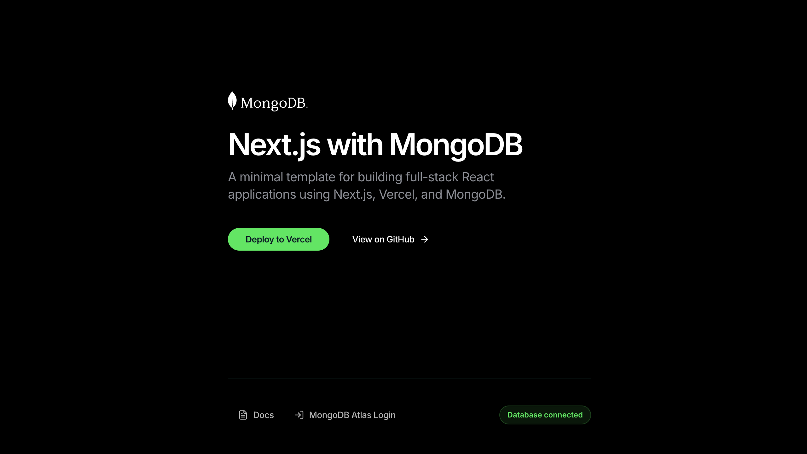

-> View demo: [nextjs.mongodb.com](https://nextjs.mongodb.com/?utm_campaign=devrel&utm_source=third-party-content&utm_medium=cta&utm_content=template-nextjs-mongodb&utm_term=jesse.hall)

# Next.js with MongoDB

A minimal template for building full-stack React applications using Next.js, Vercel, and MongoDB.

## Getting Started

Click the "Deploy" button to clone this repo, create a new Vercel project, setup the MongoDB integration, and provision a new MongoDB database:

[](https://vercel.com/new/clone?demo-description=Minimal%20template%20for%20building%20full-stack%20React%20applications%20using%20Next.js%2C%20Vercel%2C%20and%20MongoDB.&demo-image=%2F%2Fimages.ctfassets.net%2Fe5382hct74si%2F4N50YqRe7FHsd0ysfGM8bC%2F1201fe6929b842ec3ee15ee036625471%2Fog.png&demo-title=MongoDB%20%26%20Next.js%20Starter%20Template%20&demo-url=https%3A%2F%2Fnextjs.mongodb.com%2F&products=%255B%257B%2522type%2522%253A%2522integration%2522%252C%2522protocol%2522%253A%2522storage%2522%252C%2522productSlug%2522%253A%2522atlas%2522%252C%2522integrationSlug%2522%253A%2522mongodbatlas%2522%257D%255D&project-name=MongoDB%20%26%20Next.js%20Starter%20Template%20&repository-name=mongo-db-and-next-js-starter-template&repository-url=https%3A%2F%2Fgithub.com%2Fmongodb-developer%2Fnextjs-template-mongodb&root-directories=List%20of%20directory%20paths%20for%20the%20directories%20to%20clone%20into%20projects&skippable-integrations=1)

## Local Setup

### Installation

Install the dependencies:

```bash
npm install
```

### Development

#### Create a .env file in the project root

```bash
cp .env.example .env
```

#### Get your database URL

Obtain the database connection string from the Cluster tab on the [MongoDB Atlas Dashboard](https://account.mongodb.com/account/login/?utm_campaign=devrel&utm_source=third-party-content&utm_medium=cta&utm_content=template-nextjs-mongodb&utm_term=jesse.hall).

#### Add the database URL to the .env file

Update the `.env` file with your database connection string:

```txt
MONGODB_URI=mongodb+srv://<username>:<password>@<cluster-url>/<database>?retryWrites=true&w=majority
```

#### Start the development server

```bash
npm run dev
```

Open [http://localhost:3000](http://localhost:3000) with your browser to see the result.

You can start editing the page by modifying `app/page.tsx`. The page auto-updates as you edit the file.

## Learn More

To learn more about MongoDB, check out the MongoDB documentation:

- [MongoDB Documentation](https://www.mongodb.com/docs/?utm_campaign=devrel&utm_source=third-party-content&utm_medium=cta&utm_content=template-nextjs-mongodb&utm_term=jesse.hall) - learn about MongoDB features and APIs
- [MongoDB Node.js Driver](https://www.mongodb.com/docs/drivers/node/current/?utm_campaign=devrel&utm_source=third-party-content&utm_medium=cta&utm_content=template-nextjs-mongodb&utm_term=jesse.hall) - documentation for the official Node.js driver

To learn more about Next.js, take a look at the following resources:

- [Next.js Documentation](https://nextjs.org/docs) - learn about Next.js features and API
- [Learn Next.js](https://nextjs.org/learn) - an interactive Next.js tutorial

## Deploy on Vercel

Commit and push your code changes to your GitHub repository to automatically trigger a new deployment.
